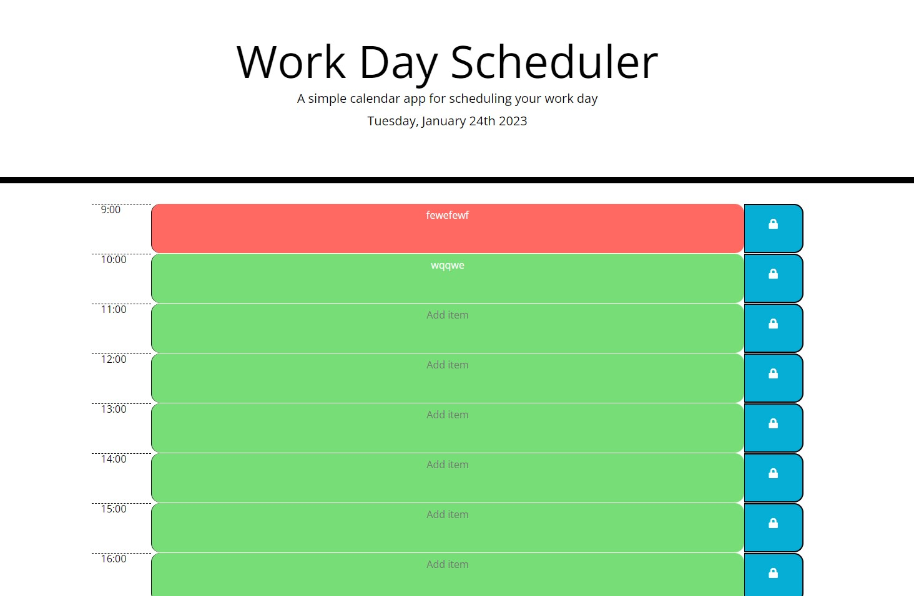
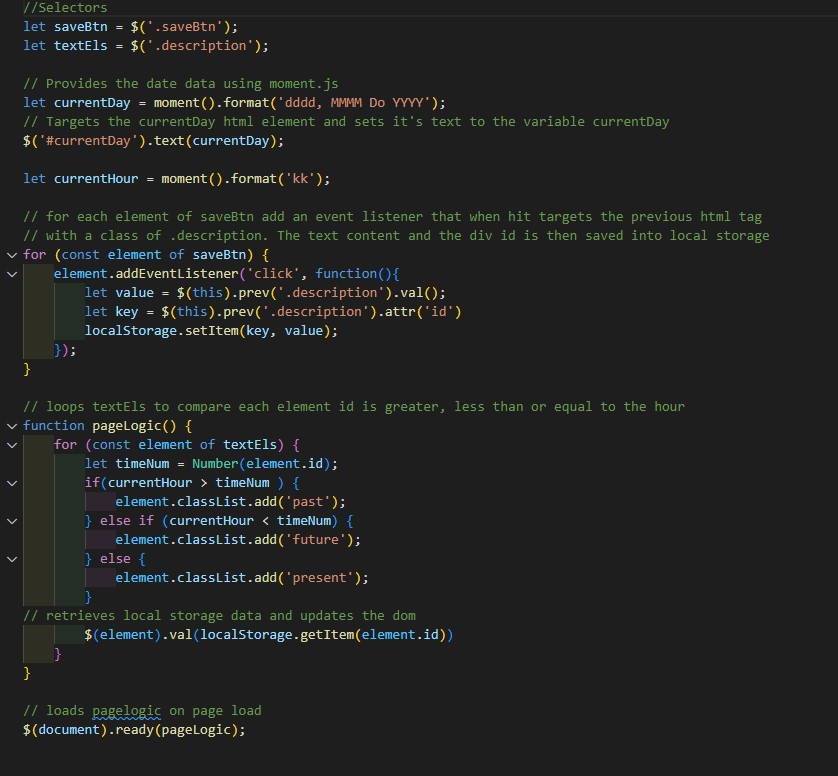
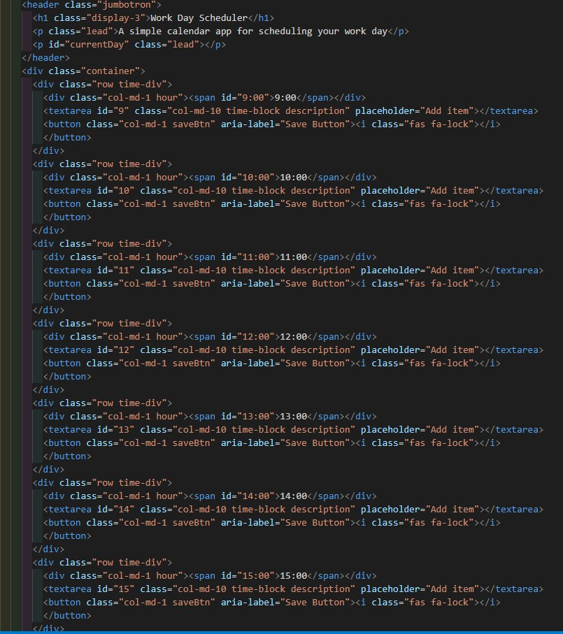

# event-planner

## Overview

An event planner that tracks the time and date and changes the display accordingly

## Site & Repo
* [Site](https://dj-86.github.io/event-planner/)
* [Repo](https://github.com/DJ-86/event-planner)

## Acceptance Criteria
* Display the current day at the top of the calender when a user opens the planner.
 
* Present timeblocks for standard business hours when the user scrolls down.
 
* Color-code each timeblock based on past, present, and future when the timeblock is viewed.
 
* Allow a user to enter an event when they click a timeblock

* Save the event in local storage when the save button is clicked in that timeblock.

* Persist events between refreshes of a page

## Resources:
* [.prev()](https://api.jquery.com/prev/)
* [For of](https://developer.mozilla.org/en-US/docs/Web/JavaScript/Reference/Statements/for...of)
* [JQuery](https://jquery.com/)
* [Moment.js](https://momentjs.com/)
* [Bootstrap](https://getbootstrap.com/)

## Screenshots

;
;

## License
* [MIT](LICENSE.md)
